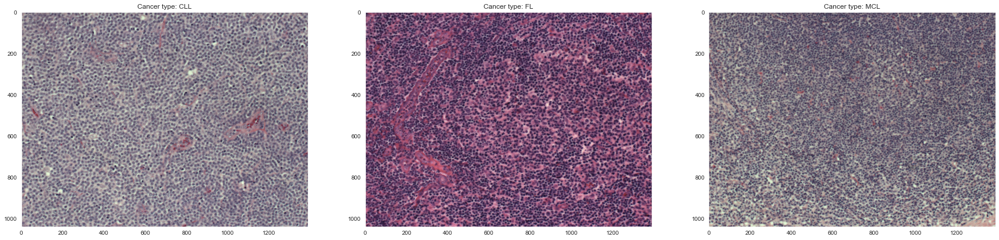

# Lymphoma Subtype Classifier

This repo is a work in progess.  It will be a multi-class classifier looking at three different types of Lymphoma and
classifying their sub-type via its immunostained biopsy image.

## Motivation

I was diagnosed and treated for Hodgkin's Lymphoma back in 2013-14 and it left an indelible mark on me.  Thankfully I've
been no evidence of disease for almost a decade now, but the experience sparked a newfound interest in human biology and
disease.

Of the myriad tests and procedures I had, one of the fundamental steps that any cancer patient undergoes is the soft
tissue biopsy, where a small snippet of the tumor is surgically extracted and analyzed to determine the exact type and
subtype of cancer the patient has.  This analysis is typically done a pathologist and while these folks are very good at
their jobs, they are of course prone to error as all humans are.

## Results

I was able to achieve an acurracy, precision, and recall of about 75% on a pretrained ResNet101 algorithm with a custom 
fully connected classification layer.  Here are the actual statistics for the entire classifier:

|     Accuracy      |   Weighted Precision   |   Weighted Recall  |   Weighted F1 Score  |
|       :---:       |         :---:          |        :---:       |       :----:         |
|        77%        |          77%           |         76%        |         77%          |

And then by individual class:

|      |  Accuracy |   Precision   |   Recall  |  F1 Score  |
| :--  |   :--:    |    :---:      |   :---:   |    :---:   |
| CLL  |    82%    |      71%      |    84%    |     77%    |
| FL   |    87%    |      85%      |    77%    |     81%    |
| MCL  |    84%    |      76%      |    68%    |     71%    |

For a more thorough look into the results of this project, please explore the notebook titled `ResultsAnalysis.ipynb` 
in the "Notebooks" directory.

### Best Performing Model

Given the size of the dataset, I used nested k-fold cross validation to select and score the models I trained using a
custom training loop.  The highest performing model utilized a pre-trained ResNet101 algorithm with a custom fully
connected classification layer.  I tested this algorithm against numerous other algorithms, please see the 
[Implementation](#Implementation) section for more details.

### Hyperparameter Grid

I used the Optuna package to run training loop trials over the hyperparameter grid I defined.

### Tools Used
Data Ingestion: Pandas, Numpy, Pillow, Pickle \
Data Augmentation: Albumentations, OpenCV \
Model Building and Training: PyTorch, Torchvision, Optuna \
K-Folding: SciKit-Learn \
Web App: Streamlit

## Installation

A conda environment has been provided with this project that has all the packages needed by the user to implement this
project.  Simply open up a conda command prompt and enter the command `conda env create --file environment.yml`.  This 
will download all the required packages that the user can utilize via the command `conda activate lymphoma_classifier`.

## Dataset

The dataset consists of immunostained biopsy slides of three different types of Non-Hodgkin's Lymphoma: Chronic
Lymphocytic Leukemia, Follicular Lymphoma, and Mantle Cell Lymphoma.

|     |   Count   |   Percentage  |
| :-- |   :---:   |     :---:     |
| CLL |    113    |      30%      |
| FL  |    139    |      37%      |
| MCL |    122    |      33%      |

Here are some sample images:

The original image dataset can be found here: 

[https://www.kaggle.com/andrewmvd/malignant-lymphoma-classification](https://www.kaggle.com/andrewmvd/malignant-lymphoma-classification)

Full credit to the authors for their outstanding work:

Orlov, Nikita & Chen, Wayne & Eckley, David & Macura, Tomasz & Shamir, Lior & Jaffe, Elaine & Goldberg, Ilya. (2010).
Automatic Classification of Lymphoma Images With Transform-Based Global Features. IEEE transactions on information
technology in biomedicine : a publication of the IEEE Engineering in Medicine and Biology Society. 14. 1003-13.
10.1109/TITB.2010.2050695.

## Implementation

### Albumentations

In order to reduce the potential for overfitting, I needed to find a way to increase the size of the training set of
images.  Both PyTorch and 

### Nested K-Fold

The number of outer loops was defined by the number of algorithms I was testing.  In order to maintain a reasonable test
set size and increase my confidence in the performance statistics, I tested the algorithms in batches.

### Algorithms

Trained models of seven different algorithm types, ResNet18, ResNet34, ResNet101, MobileNetV2, VGG13, VGG13 with batch
norm, VGG16, and VGG16 with batch norm.  Since the dataset is so small, I utilized pretrained models.

### Training Loop

Because of the richness and size of the images, I did not have the luxury of creating dataloaders to send to the GPU to
be stored in memory.

### Streamlit Web App

In order to launch the web app, use the command `streamlit run /path/to/project/StreamlitApp.py`.
