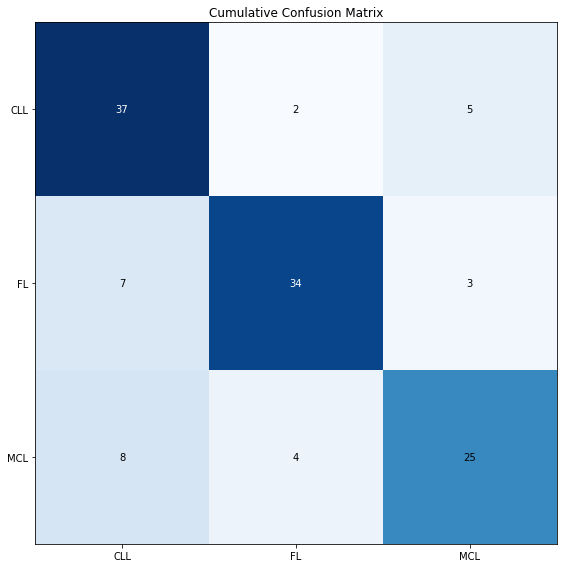
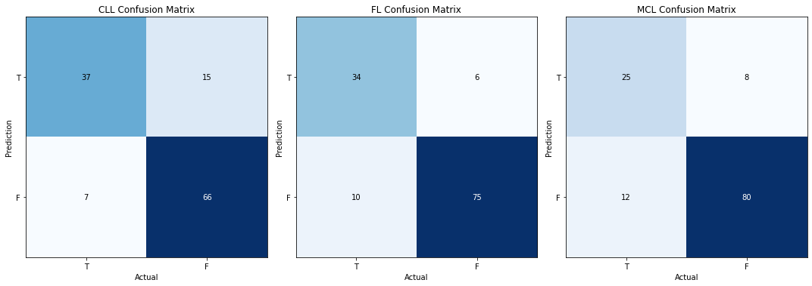
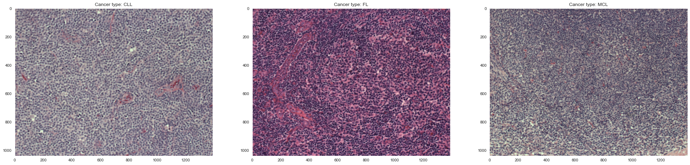
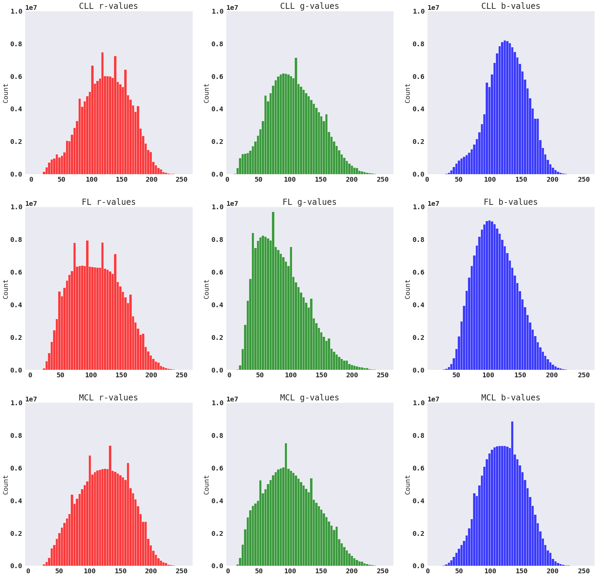
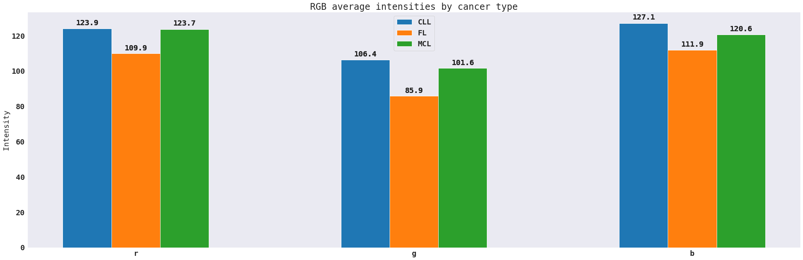

# Lymphoma Subtype Classifier

This repository contains a multiclass classifier powered by a convolutional neural network that has been trained to 
identify three unique subtypes of Non-Hodgkin's Lymphoma, specifically Chronic Lymphocytic Leukemia (CLL), Follicular 
Lymphoma (FL), and Mantle Cell Lymphoma (MCL).

## Motivation

I was diagnosed and treated for Hodgkin's Lymphoma back in 2013-14 and it left an indelible mark on me.  Thankfully I've
been no evidence of disease for almost a decade now, but the experience led me to discover a newfound interest in human 
biology and disease.

Of the myriad tests and procedures I had, one of the fundamental steps that any cancer patient undergoes is the soft
tissue biopsy, where a small snippet of the tumor is surgically extracted and analyzed to determine the exact type and
subtype of cancer the patient has.  This analysis is typically done a pathologist and while these folks are very good at
their jobs, they are of course prone to error as all humans are.  This effort is not designed to replace the human being
doing the important work of classifying cancer types, but to supplement their work and provide a "second opinion".

## Results

I was able to achieve an acurracy, precision, and recall of about 75% on a pretrained ResNet101 algorithm with a custom 
fully connected classification layer.  Here are confusion matrices both for the classifier as a whole and then by
individual class:

  

  

Here's the tabular statistics for the entire classifier:

  <table>
  
|     Accuracy      |   Weighted Precision   |   Weighted Recall  |   Weighted F1 Score  |
|       :---:       |         :---:          |        :---:       |       :----:         |
|        77%        |          77%           |         76%        |         77%          |

  </table>

  
And then by individual class:

  <table>

|      |  Accuracy |   Precision   |   Recall  |  F1 Score  |
| :--  |   :--:    |    :---:      |   :---:   |    :---:   |
| CLL  |    82%    |      71%      |    84%    |     77%    |
| FL   |    87%    |      85%      |    77%    |     81%    |
| MCL  |    84%    |      76%      |    68%    |     71%    |

  </table>

For a more thorough look into the results of this project, please explore the notebook titled `ResultsAnalysis.ipynb` 
in the "Notebooks" directory.

### Best Performing Model

Given the size of the dataset, I used nested k-fold cross validation to select and score the models I trained using a
custom training loop.  The highest performing model utilized a pre-trained ResNet101 algorithm with a custom fully
connected classification layer.  I tested this algorithm against numerous other algorithms, please see the 
[Implementation](#Implementation) section for more details.

### Hyperparameter Grid

I used the Optuna package to run training loop trials over the hyperparameter grid I defined.  Among the hyperparameters
were the choice of an optimizer, the batch size, the learning rate of course, the number of times the training data
passed through the data augmentation pipeline, etc.

### Tools Used
Data Ingestion: Pandas, Numpy, Pillow, Pickle \
Data Augmentation: Albumentations, OpenCV \
Model Building and Training: PyTorch, Torchvision, Optuna \
K-Folding: SciKit-Learn \
Web App: Streamlit

## Installation

A conda environment has been provided with this project that has all the packages needed by the user to implement this
project.  Simply open up a conda command prompt and enter the command `conda env create --file environment.yml`.  This 
will download all the required packages that the user can utilize via the command `conda activate lymphoma_classifier`.

## Dataset

The dataset consists of immunostained biopsy slides of three different types of Non-Hodgkin's Lymphoma: Chronic
Lymphocytic Leukemia, Follicular Lymphoma, and Mantle Cell Lymphoma.

  <table>

|     |   Count   |   Percentage  |
| :-- |   :---:   |     :---:     |
| CLL |    113    |      30%      |
| FL  |    139    |      37%      |
| MCL |    122    |      33%      |

  </table>

Here are some sample images:

  

The dimensions of all the images in the dataset are equal, there are no nulls in any of the image arrays, and their color
intensities range from 0 to 255 (0x00-0xFF in hex) as expected.

I then examined the distribution of RGB color intesities by cancer type to try to distinguish a pattern between the types:

  

  

Standard deviations by cancer type and color:

  <table>

|    |    CLL   |     FL     |   MCL     | 
| :- |   :---:  |    :---:   |   :---:   | 
| r  |   39.24  |    41.58   |   40.76   | 
| g  |   40.47  |    39.84   |   43.20   |
| b  |   31.59  |    33.23   |   33.99   | 

  </table>

The original image dataset can be found here: 

[https://www.kaggle.com/andrewmvd/malignant-lymphoma-classification](https://www.kaggle.com/andrewmvd/malignant-lymphoma-classification)

Full credit to the authors for their outstanding work:

Orlov, Nikita & Chen, Wayne & Eckley, David & Macura, Tomasz & Shamir, Lior & Jaffe, Elaine & Goldberg, Ilya. (2010).
Automatic Classification of Lymphoma Images With Transform-Based Global Features. IEEE transactions on information
technology in biomedicine : a publication of the IEEE Engineering in Medicine and Biology Society. 14. 1003-13.
10.1109/TITB.2010.2050695.

## Implementation

### Image Loading

The image loading for this project is performed using Pandas, PIL, and optionally, Pickle.  The dataset is sourced from
the `'./Images'` directory, containing subdirectories for each of the Lymphoma types.

### Albumentations

In order to reduce the potential for overfitting, I needed to find a way to increase the size of the training set of
images.  Both Torchvision and OpenCV have extensive libraries for altering image data, but after doing the background
research, I came away really impressed with the Albumentations library and decided to use it as my transformation
pipeline.

Albumentations uses a `Compose` class that is almost identical to the Torchvision `Compose` class, where you can define
the possible transformations, the extent to which those transformations alter the image, and the probability that a given
tranform in the pipeline is applied to the input image.  For some descriptive statistics on the pipeline, please see the
`ExploratoryDataAnalysis` notebook.

### Nested K-Fold

I utilized SciKit-Learn's k-fold functions to get the shuffled indices of the original dataframe to build training,
validation, and testing sets.  Ordinarily, getting the indices is a bit redundant because you can instead just return
the k-folded dataframes, but because I was doing data augmentation on the training set, I needed to have account of just
the indices.

The number of outer loops was defined by the number of algorithms I was testing.  In order to maintain a reasonable test
set size and increase my confidence in the performance statistics, I tested the algorithms in batches, so instead of 
testing all seven algorithms at once, I tested them in groups of three and four.

### Algorithms

Trained models of seven different algorithm types, ResNet18, ResNet34, ResNet101, MobileNetV2, VGG13, VGG13 with batch
norm, VGG16, and VGG16 with batch norm.  The dataset I was working with was not sufficiently large that I could
successfully train a deep network, so I utilized pretrained models instead.  This meant that I was training only the 
output layer, which was customized for each family of algorithm.

### Training Loop

Created a custom PyTorch Dataset class, created a Dataloader based off of this Dataset class.

Because of the richness and size of the images, I did not have the luxury of creating dataloaders to send to the GPU to
be stored in memory.  This meant that I needed to create the dataset and dataloader objects within each training loop,
which was a substantial design challenge on its own.

### Streamlit Web App

As a final product, I built a web app with Streamlit that is designed to mimic the experience of the pathologist, where
a new biopsy slide appears and it's up to them to discern the cancer type.  On the left hand side is the sample image
and the right contains the transformations that can be performed on the image, to try to confuse the model into thinking
the sample is from a different subtype.  Pressing the "Run Model" button will run the image through the trained model
and output a predicted label, alongside the actual label.  It's not a perfect model of course, so it can be fooled, but
generally speaking the model has a high degree of accuracy as evidenced by the performance statistics and that should be
evident when you use the app.

In order to launch the web app, use the command `streamlit run /path/to/project/StreamlitApp.py`.
